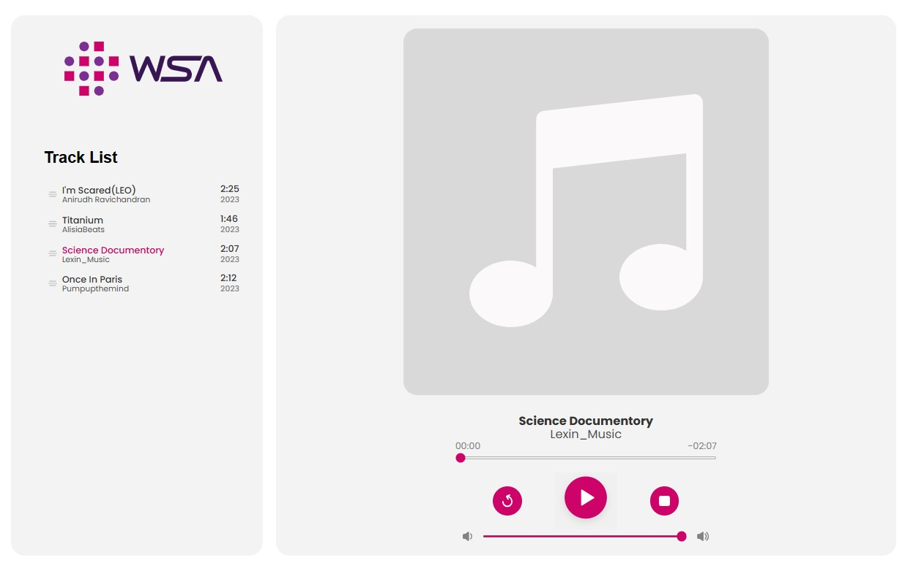
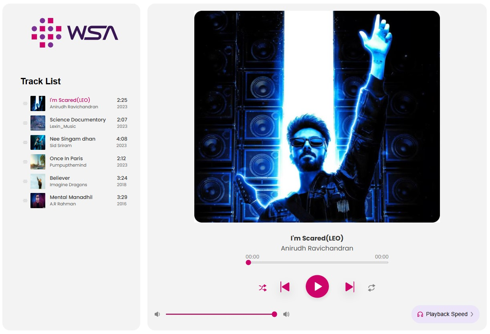

# WSA Music Player App

This project is a two-level music player application built using HTML, CSS, and JavaScript.  
It showcases an upgrade from a simple UI (Level 1) to a fully functional interactive player with play/pause and progress control (Level 2).

## 📁 Project Structure

WSA-Music-Player-App/  
├── level1/ --> Music Player UI  
├── level2/ --> Interactive Music Player  
└── README.md  

Each level contains its own `index.html`, `style.css`, and `script.js` files.  
Open the `index.html` file in either folder to preview the corresponding version of the app.

---

## 🔗 App Previews

Version : Level 1, Preview Link : [View App](https://emertxeinfotech.github.io/wsa-music-player-app/level1/)  
Screenshot :   

Version : Level 2, Preview Link : [View App](https://emertxeinfotech.github.io/wsa-music-player-app/level2/)  
Screenshot :   

---

## 🛠️ Tech Stack

- **HTML5** for structure  
- **CSS3** for styling using Flexbox  
- **JavaScript (Vanilla)** for DOM manipulation and player controls  

---

## ✨ Features

### ✅ Level 1 (Music Player UI)

- Static UI representing a music player  
- Album art, song name, artist name, play button, and progress bar layout  
- Responsive design with Flexbox  

### ✅ Level 2 (Interactive Music Player)

- All Level 1 UI features plus:  
  - `Play` and `Pause` functionality  
  - Live progress bar syncing with song time  
  - Dynamic updates of time, duration, and progress  
  - Basic media control using JavaScript's `Audio` object  

---

## 📚 Concepts Used

- DOM Manipulation (`querySelector`, `addEventListener`, etc.)  
- Media control using `audio.play()`, `audio.pause()`  
- Real-time progress bar updates using `setInterval`  
- Time formatting logic for duration and current time  
- Flexbox layout and responsive design principles  

---

## 📌 How to Run Locally

Run the `index.html` file inside each level folder (`level1/` or `level2/`) using a browser to preview the app.

---

## 📄 License

© 2023 WSA. All rights reserved.
